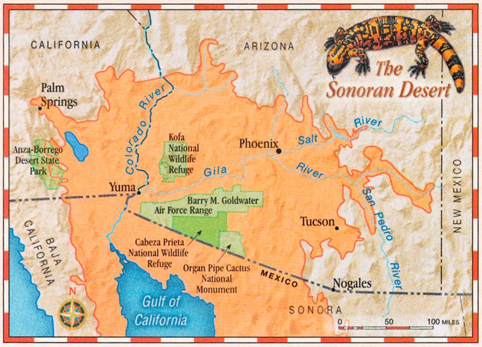

```{r setup, include=FALSE}
#Its common to have a setup area to help keep track of required packages and formatting options
library(tidyverse) #importing, tidying, plotting data
library(knitr) #making tables
library(janitor) #cleaning variable names - https://github.com/sfirke/janitor
library(readxl) #importing data from excel spreadsheets.
```

A common best-practice is to clean data before starting analysis. Make sure data, variables, and other elements have consistent formatting. This includes having a common case of text, common delimiters, and removal of punctuation and other nuisance charaters.

It is important to do all your data cleaning in a reproducible way so your steps are traceable; do not just go back to the data file (.xlsx, .csv, etc.) and make changes. This is especially important if you have collaborators that will continue to send you additional or updated data while you are working on analyses.

Example data are from [Ord and Klomp 2014](https://link.springer.com/content/pdf/10.1007/s00442-014-2921-y.pdf), for several species of "Flying Dragons" of Southeast Asia.


<br>

<br>

First, lets import an Excel file, which is the root cause of many data formatting problems because it does not require adherence to any formatting standards. Unfortunately, nearly everyone will enter their data in Excel and your collaborators will almost certainly send you their data contributions as an .xlsx file.

```{r import raw data}
data_lizards_raw <- read_excel("data/data_morph_lizards.xlsx")
```

The data import function`read_excel` already detects that we have duplicate column names in the data. It appends the number of the column to each duplicated column name to make a unique (but nonsensical) name for each. Notice also that column names with spaces get wrapped in ticks ("grave accent"); R does not like spaces in column names.

```{r}
glimpse(data_lizards_raw)
```

We are going to use a package called `janitor` to help perform some of the more common cleaning tasks. The package follows the principles of the `tidyverse` and in particular works well with the %\>% pipe function. `janitor` was built with beginning-to-intermediate R users in mind. Advanced users can probably do everything covered in the package with base R or `tidyverse`, but they can do it faster with janitor and save their thinking for the data analysis phase.

Dirtiness includes:

-   A header or metadata at the top
-   Horrible column names
-   Unsupported symbols or punctuation
-   Rows and columns containing Excel formatting but no data
-   Dates in two different formats in a single column (MM/DD/YYYY and numbers)
-   Values spread inconsistently over columns
-   Duplicated records

<br>

For the current dataset, the primary issue that needs addressed is unruly column names.

```{r clean the data}
data_lizards_clean <- 
  read_excel("data/data_morph_lizards.xlsx") %>% 
  clean_names() %>% #makes variable have consistent formatting and pretty
  remove_empty(which = c("rows","cols")) # remove both empty columns and rows; happens a lot when importing Excel data
```

What does this do?

-   Reformats names to have only lowercase letters, and uses \_ as a separator; reduces cognitive load
-   Handles special characters and spaces
-   Appends numbers to duplicated column names
-   Removes empty columns and rows that often persist in Excel sheets

Lets compare the raw versus the cleaned data after the first pass.

```{r echo=FALSE}
combined <- data.frame(raw = colnames(data_lizards_raw), cleaned = colnames(data_lizards_clean))
kable(combined, caption = 'Table 1. A knitr kable displaying the raw vs. cleaned data.')
```

The new variable names are still rather long, and you might choose to use `dplyr::mutate` to make more truncated names for brevity. Also, the warning message told us the SVL variable is listed twice. Lets remove it and fix SVL label in column 5.

```{r drop duplicate columns}
data_lizards_clean <- select(data_lizards_clean, -svl_mm_14) %>% #drop column svl_mm_14
  rename(svl_mm = svl_mm_5)
```

View cleaned variable names.

```{r view cleaned variable names}
names(data_lizards_clean)
```

OK, looks pretty good. One last thing is to check whether there are any duplicate records that should be excluded. Because each lizard should only appear once in the dataset, id is a good variable to use to search for duplicates.

```{r get duplicate records}
data_lizards_clean %>% janitor::get_dupes(id)
```

Can exclude the two duplicates.

```{r use unique records}
data_lizards_clean <- dplyr::distinct(data_lizards_clean) #takes only the unique observations.
```

```{r view cleaned data}
head(data_lizards_clean) #first six obs. of cleaned data set; no wonky names, no dupes, consistent formatting
```

Lets give the data a quick summary look. `janitor` has several built-in functions to summarize data while cleaning.

```{r quick table}
janitor::tabyl(data_lizards_clean, species)
```

<br>
<br>
<br>
<br>

OK, lets try a different dataset with some different formatting problems that need cleaning. 



This is what the raw datafile looks like:


Obviously it is some great data, but it has several formatting issues R will not like:

-   Headers describing what the data are and who collected it ('meta-data' type info).
-   Column titles are all over the place; capitalization, spaces, punctuation, etc.
-   Empty columns and rows

<br>

We can use a `janitor` function inside our data import chunk to help.

```{r}
data_CochiseCoGila <- read_excel("data/HelodermaData_WilliamRadke_07292025.xlsx",
                                skip = 3, #skip first 3 rows of datafile
                                .name_repair = janitor::make_clean_names) #janitor function plays well with read_excel

glimpse(data_CochiseCoGila)
```

It did a **LOT** of cleaning in just a few lines of code. But there are a few issues remaining in order to make the data useful in analyses.

<br>

In the raw dataset some individuals are given an **Specimen ID** (roadkill specimens) and others are given a **PIT Tag** when captured alive and released. There should really only be one column for a unique identifier; lets copy the necessary information from one column to the other (specimen_id, pit_tag).

```{r copy PIT tag numbers to specimen_id field to give each individual a unique identifier}
data_CochiseCoGila <- data_CochiseCoGila %>%
  mutate(specimen_id = na_if(specimen_id, ""),   # turn empty strings into NA
         specimen_id = coalesce(specimen_id, pit_tag))
```

I don't love the long column (variable) names so lets make them a bit more user-friendly to reduce typing and cognitive load. Also need to adjust the sign on longitude to be able to plot on a map.

```{r clean and format Radke field data}
data_CochiseCoGila <- data_CochiseCoGila %>%
  rename(
  id = specimen_id,
  dor = dor_y_n,
  recap = recap_y_n,
  lat = latitude_n,
  lon = longitude_w,
  svl = svl_mm,    # Snout-Vent Length (mm)
  tl = tl_mm,  # Tail Length (mm)
  mass = mass_g) %>% # Mass (g)
  mutate(
    date = ymd(date),
    hour = hour(time),
    time = hms::as_hms(time),  # Convert POSIXct datetime to time-of-day
    month_cat = factor(month(date, label = TRUE, abbr = TRUE))
  )

data_CochiseCoGila$lon <- data_CochiseCoGila$lon*-1 #convert longitude to negative number for plotting
```

```{r}
glimpse(data_CochiseCoGila)
```

```{r}
data_CochiseCoGila
```

Additional janitor function reference: <https://cran.r-universe.dev/janitor/doc/manual.html>

Common cleaning tasks:

-   Cleans names of an object (usually a data.frame).
-   Round the numeric columns in a data.frame.
-   Convert date and datetime formats received from Microsoft Excel
-   find duplicated rows and columns
-   find empty rows and columns
-   find and remove header rows

Let me re-emphasize that you should do all your data cleaning in R. In the file shown above my collaborator sent me several different and updated versions of the data. Each of us found errors and typos as we worked and we fixed them in the raw data sheet. After each updated version of the data it was trivial to clean the data and remake all the figures, table, and analyses because it was all coded. 